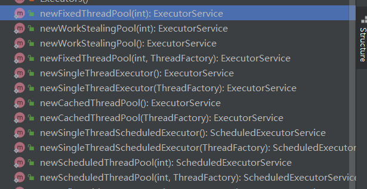
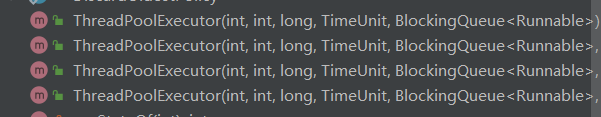
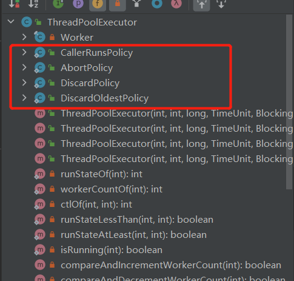
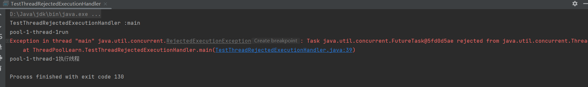
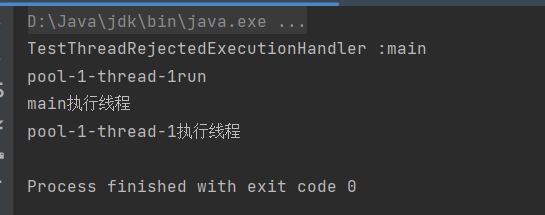
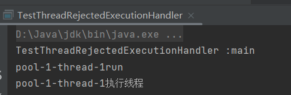
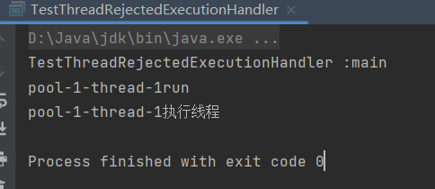
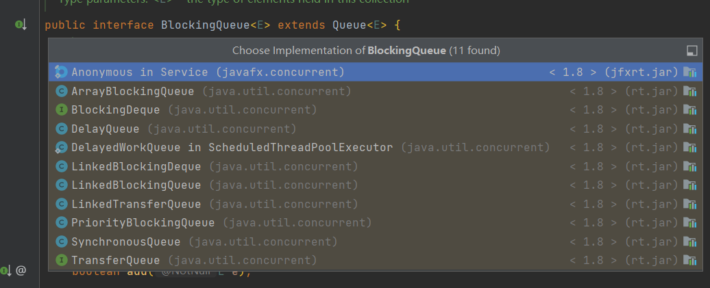

# Thread Pool Learn

## 1、线程池概念

1、线程池是一个线程容器，可以设置线程分配的数量上限。

2、将预先创建的线程对象放入线程池，并重用线程池中的线程对象。

3、避免频繁的创建和销毁线程。

## 2、线程池的创建方式

### 2.1、线程继承类结构

底层接口：`Executor`    `ExecutorService` 其中 service可以开启关闭提交线程等抽象方法

核心抽象类：`AbstractExecutorService`  

最常使用的子类：`ThreadPoolExecutor` 

辅助建立一些常用的线程池:  `Executors`

 

创建线程的核心类是哪个 ？？？？

> `ThreadPoolExecutor` 可以指定核心线程数等信息


### 2.2、创建四种基本线程池 

```Java
        // 先创建固定线程数的线程池  阿里并不推荐使用这个固定线程池
        ExecutorService executorService = Executors.newFixedThreadPool(6);
        // 创建缓存线程池
        ExecutorService executorService1 = Executors.newCachedThreadPool();
        // 单例线程
        ExecutorService executorService2 = Executors.newSingleThreadExecutor();
        // 异步线程
        ScheduledExecutorService scheduledExecutorService = Executors.newScheduledThreadPool(2);
```


### 2.3、对四种线程池进行比对以及总结

大厂结论：

> 不推荐使用这个 `Executors`去创建线程池 ，主要的原因就是让自己手动设置线程池的参数，更为精准的使用资源

这四种都是 `ThreadPoolExecutor` 都是通过这个类建立的线程池

`FixedThreadPool` : 固定线程数

```java
public static ExecutorService newFixedThreadPool(int nThreads) {
    return new ThreadPoolExecutor(nThreads, nThreads,
                                  0L, TimeUnit.MILLISECONDS,
                                  // 阻塞队列
                                  new LinkedBlockingQueue<Runnable>());
    // 采用的是链表阻塞队列
    // 核心线程数为参数 
    // 最大线程数为参数
    // 存活时间为OL
    // 时间单位 为毫秒
    // 队列方式为阻塞队列
}
```


`CachedThreadPool` : 缓存线程池

```Java
    /**
     * 缓存线程池
     * @param threadFactory 线程任务数量
     * @return
     */
    public static ExecutorService newCachedThreadPool(ThreadFactory threadFactory) {
        return new ThreadPoolExecutor(0, Integer.MAX_VALUE,
                60L, TimeUnit.SECONDS,
                                      // 同步队列
                new SynchronousQueue<Runnable>(),
                threadFactory);
    }
```


`SingleThreadExecutor` 创建单线程线程池

```Java
/**
 * 创建单例线程数
 * @param threadFactory the factory to use when creating new
 * threads
 *
 * @return the newly created single-threaded Executor
 * @throws NullPointerException if threadFactory is null
 */
public static ExecutorService newSingleThreadExecutor(ThreadFactory threadFactory) {
    return new FinalizableDelegatedExecutorService
        (new ThreadPoolExecutor(1, 1,
                                0L, TimeUnit.MILLISECONDS,
                                new LinkedBlockingQueue<Runnable>(),
                                threadFactory));
}
```


`ScheduledThreadPoolExecutor` 异步线程池

```Java
// 核心参数应该是 DelayedWorkQueue创建延迟的工作队列
public ScheduledThreadPoolExecutor(int corePoolSize) {
    super(corePoolSize, Integer.MAX_VALUE, 0, NANOSECONDS,
          new DelayedWorkQueue());
}
```


## 3、`ThreadPoolExecutor`线程池的参数解析

### 3.1、查看构造方法 进行参数解析

共有四个构造方法

 


```Java
public ThreadPoolExecutor(int corePoolSize,
                          int maximumPoolSize,
                          long keepAliveTime,
                          TimeUnit unit,
                          BlockingQueue<Runnable> workQueue) {
    this(corePoolSize, maximumPoolSize, keepAliveTime, unit, workQueue,
         Executors.defaultThreadFactory(), defaultHandler);
}
```


```Java
public ThreadPoolExecutor(int corePoolSize,
                          int maximumPoolSize,
                          long keepAliveTime,
                          TimeUnit unit,
                          BlockingQueue<Runnable> workQueue,
                          ThreadFactory threadFactory) {
    this(corePoolSize, maximumPoolSize, keepAliveTime, unit, workQueue,
         threadFactory, defaultHandler);
}
```


```Java
public ThreadPoolExecutor(int corePoolSize,
                          int maximumPoolSize,
                          long keepAliveTime,
                          TimeUnit unit,
                          BlockingQueue<Runnable> workQueue,
                          RejectedExecutionHandler handler) {
    this(corePoolSize, maximumPoolSize, keepAliveTime, unit, workQueue,
         Executors.defaultThreadFactory(), handler);
}
```


核心构造方法

```Java
 /**
     * 
     * @param corePoolSize 核心线程数
     * @param maximumPoolSize 最大线程数
     * @param keepAliveTime 存活时间
     * @param unit 时间单位
     * @param workQueue 工作队列
     * @param threadFactory 任务工厂 里面全部都是线程
     * @param handler 拒绝策略处理器
     */
    public ThreadPoolExecutor(int corePoolSize,
                              int maximumPoolSize,
                              long keepAliveTime,
                              TimeUnit unit,
                              BlockingQueue<Runnable> workQueue,
                              ThreadFactory threadFactory,
                              RejectedExecutionHandler handler) {
        if (corePoolSize < 0 ||
                maximumPoolSize <= 0 ||
                maximumPoolSize < corePoolSize ||
                keepAliveTime < 0)
            throw new IllegalArgumentException();
        if (workQueue == null || threadFactory == null || handler == null)
            throw new NullPointerException();
        this.acc = System.getSecurityManager() == null ?
                null :
                AccessController.getContext();
        this.corePoolSize = corePoolSize;
        this.maximumPoolSize = maximumPoolSize;
        this.workQueue = workQueue;
        this.keepAliveTime = unit.toNanos(keepAliveTime);
        this.threadFactory = threadFactory;
        this.handler = handler;
    }
```


### 3.2、拒绝策略 `RejectedExecutionHandler` 解析

#### 3.2.1、源码中的拒绝策略实现

 


- CallerrunsPolicy  

  - 完全交予主线程处理

  - ```
    
    ```

- AbortPolicy

  - 不处理只抛出异常

- DiscardOldestPolicy

  - 完全不处理

- DiscardPolicy

  - 删除线程池中最旧的任务并把这个任务添加到线程池中

#### 3.2.2、测试四种拒绝策略的不同

`AbortPolicy`：测试

```java
public static void main(String[] args) {
    System.out.println("TestThreadRejectedExecutionHandler :" + Thread.currentThread().getName());
    // 创建一个核心线程数和最大线程数都为1的线程池
    // 队列方式采用的是阻塞队列
    // 当超过阻塞队列的时候是会存在报错的
    ExecutorService poolExecutor = new ThreadPoolExecutor(1,
            1,
            0L,
            TimeUnit.SECONDS,
            new LinkedBlockingQueue<>(1),
            new ThreadPoolExecutor.AbortPolicy());
    poolExecutor.submit(() -> {
        System.out.println(Thread.currentThread().getName() + "run ");
        try {
            Thread.sleep(1000);
        } catch (InterruptedException e) {
            throw new RuntimeException(e);
        }
    });
    poolExecutor.submit(() -> {
        System.out.println(Thread.currentThread().getName() + "执行线程");
        try {
            Thread.sleep(1000);
        } catch (InterruptedException e) {
            throw new RuntimeException(e);
        }
    });
    poolExecutor.submit(() -> {
        System.out.println(Thread.currentThread().getName() + "执行线程");
        try {
            Thread.sleep(1000);
        } catch (InterruptedException e) {
            throw new RuntimeException(e);
        }
    });
    poolExecutor.shutdown();
}
```

结果：出现了异常 




CallerrunsPolicy  ：直接交予主线程执行这个任务

代码同上，修改拦截策略

结果：

 

主线程执行了超过线程池的最大线程数和队列的长度就会触发拒绝策略


`DiscardOldestPolicy`：删除队列中最老的任务 之后将任务添加到线程中

 


`DiscardPolicy`： 拒绝任何处理

 


### 3.3、阻塞队列的不同以及选型

目前线程池中所有的阻塞队列都是通过实现 `BlockingQueue`实现的

 